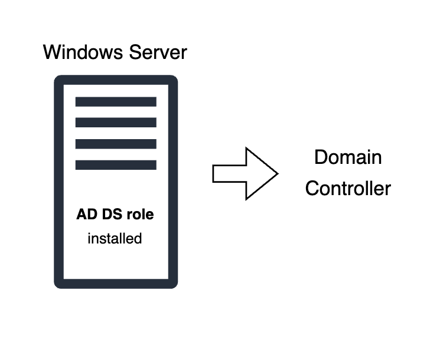
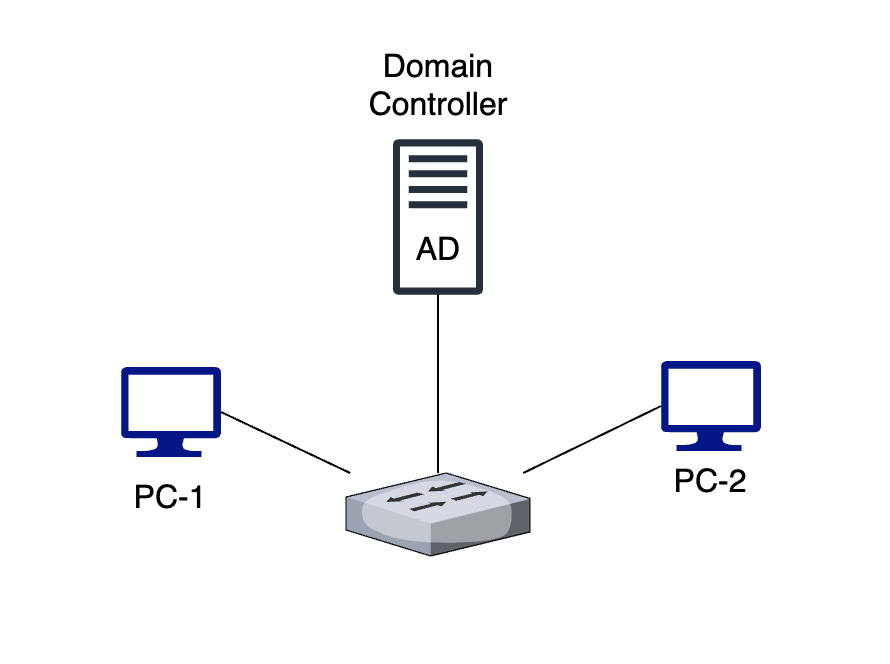

# Home Lab Concept Dictionary
___

### 🔸 Active Directory

**What is it?** A Microsoft directory service is an Identity and Access Management (IAM) system that stores information about objects, such as users, groups, devices, and more, in a secure, hierarchical structure.

   
  <em>Figure 1: Active Directory Domain Services (AD DS) role installed on a Windows Server </em>

**What does it do?** Organize and manage devices and users in a IT infrastructure.

**Lab Implementation (My Experience)**: Installed the AD DS role from Server Manager and created a forest domain. Inside the forest, there is an Organizational Unit (OU) that allows setting permissions and roles for users, groups, and computers, providing a centralized IT infrastructure.

___
---
### 🔸 Domain Controller (DC)

**What is it?** A server running Active Directory, implemented to centrally authenticate and manage users within a domain. Important note: Active Directory (AD) is the overall system, while Active Directory Domain Services (AD DS) is a specific server role. A server only becomes a Domain Controller onces it has been promoted with AD DS role.

   
  <em>Figure 2: Domain Controller Architecture Overview</em>

**What does it do?**  
- Authenticate the identity of users and computers
- Authorize access, permissions to resources inside a domain

**Lab Implementation (My experience)**: In my Microsoft Azure homelab, I deployed a Windows Server 2025 image and promoted to a DC. By installing and configuring AD DS, I created a centralized management for the madeup users and groups in my virtual network.

---
---

## 🔸 Registery

**What is it?**

**What does it do?**

**Lab Implementation (My Experience)**:

---
---

## 🔸 Default Domain Policy

**What is it?**

**What does it do?**

**Lab Implementation (My Experience)**:

---
---

## 🔸 Group Policy Management Editor

**What is it?**

**What does it do?**

**Lab Implementation (My Experience)**:

---
---

## 🔸 Policies vs Preferences

**What is it?**
- Policies: Users does not have the right to change any options. Implemented with the registery.

- Preferences: Users can decide its own rules to set. The original preference setting will default after each start up.

**What does it do?**

**Lab Implementation (My Experience)**:

---
---

## 🔸 Computer Configuration

**What is it?**

**What does it do?**
- Settings applies to the computer itself, and configure how the machines should behave.

**Lab Implementation (My Experience)**:

---
---

## 🔸 User Configuration

**What is it?**

**What does it do?**
- Setting applies to the user, no matter what computer they log into.

**Lab Implementation (My Experience)**:

---
___

## 🔸 VNet

**What is it?**

**What does it do?**

**Lab Implementation (My Experience)**:

---
---

## 🔸 Subnet

**What is it?**

**What does it do?**

**Lab Implementation (My Experience)**:

---
---

## 🔸 Ethernet Connctor

**What is it?**

**What does it do?**

**Lab Implementation (My Experience)**:

---
---

## 🔸 Domain Credentials

**What is it?**

**What does it do?**

**Lab Implementation (My Experience)**:

---
---

## 🔸 Local Credentials

**What is it?**

**What does it do?**

**Lab Implementation (My Experience)**:

---
---

## 🔸 Local Credentials

**What is it?**

**What does it do?**

**Lab Implementation (My Experience)**:

---
---

## 🔸 Server Manager

**What is it?**

**What does it do?**

**Lab Implementation (My Experience)**:

---
---

## 🔸 DHCP

**What is it?**

**What does it do?**

**Lab Implementation (My Experience)**:

---
---

## 🔸 DNS

**What is it?**

**What does it do?**

**Lab Implementation (My Experience)**:

---
---

## 🔸 Organizational Unit

**What is it?**

**What does it do?**

**Lab Implementation (My Experience)**:

---
---

## 🔸 Root Domain Name

**What is it?**

**What does it do?**

**Lab Implementation (My Experience)**:

---
---

## 🔸 Forest

**What is it?**

**What does it do?**

**Lab Implementation (My Experience)**:

---
---