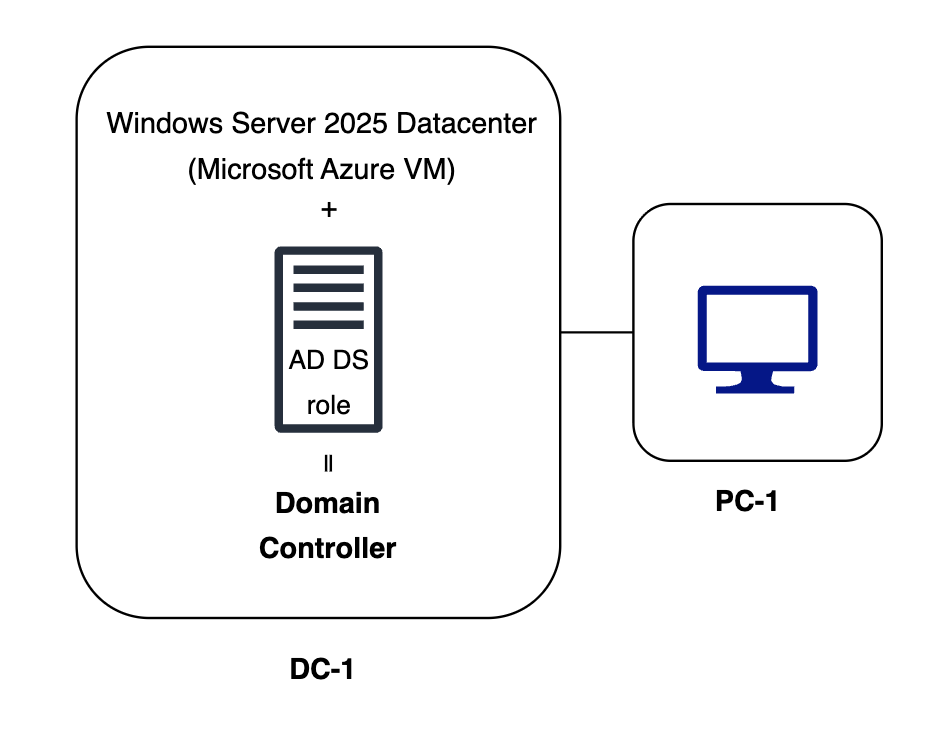
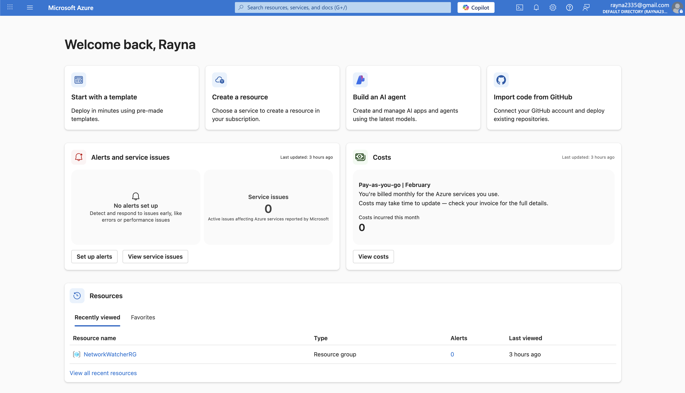
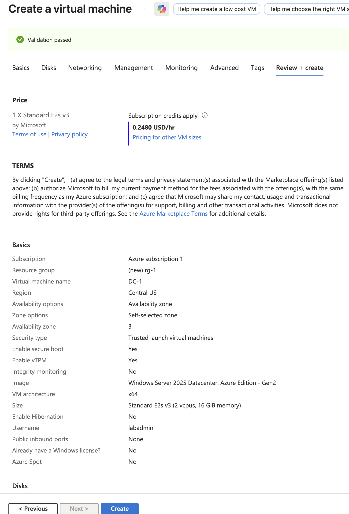
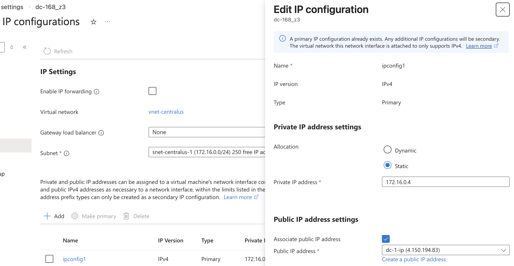
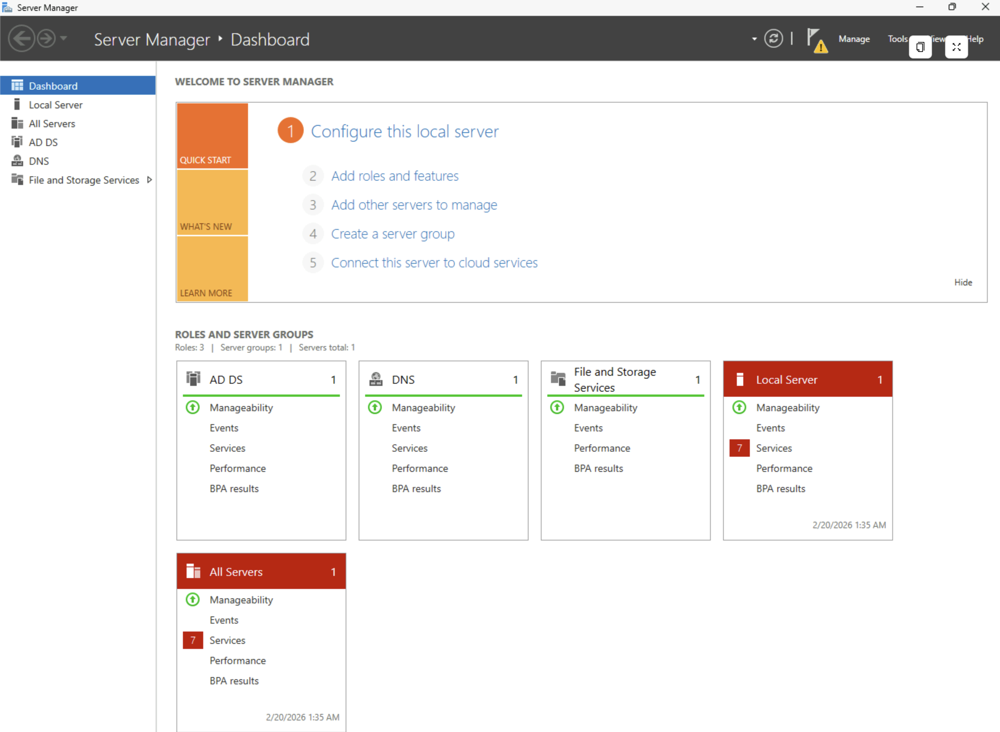

# Windows Server 2025 Deployment on Microsoft Azure

## Objective
Deploy and configure a Windows Server 2025 virtual machine in Microsoft Azure and to install the tools and features such as, Active Directory Domain Services, DNS Server, and Group Policy Management. 

## Lab Environment
**Cloud Platform:** Microsoft Azure 
**Operating System:** Windows Server 2025 Datacenter: Azure Edition

## Prerequisites
- Create an account on [Microsoft Azure](https://portal.azure.com/auth/login/)

## Network Diagram

   
  <em>Active Directory Domain Services (AD DS) role installed on a Windows Server 2025 Datacenter on Azure, and PC-1 for the client </em>

## Steps
### Step 1: Create a Microsoft Azure account

### Step 2: Create a Virtual Machine
- Click on 'create a resource' and click on 'Create' for the Virtual machine option.

### Step 3: Configure the Virtual machine

**Subscription**: Azure Subscription 1 
**Resource Group**: Name your Window server (Purpose is to keep all resources together) 
**Virtual machine name**: Name your VM 
**Region**: Enter your location  
**Availability options**: Availability zone 
**Zone option**: Self-selected zone 
**Availablity zone**: Zone 3 
**Security type**: Trusted launch virtual machines 
**Image**: Windows Server 2025 Datacenter: Azure Edition - x64 Gen2 
**Size**: Standard_E2s_v3 - 2 vcpus, 16 GiB memory ($181.04) 
**Username**: Enter any username 
**Password**: Enter any password 
**Inbound ports**: None

### Step 4: Wait for deployment to complete processing
- Click on 'Create' to delopy VM.

### Step 5: Set static IP for Domain Controller (DC)
- After successful deployement message, click on **Go to resource**.
- Click on the 'Networking** dropdown menu, then 'Network settings'.
- Click on your **Network interface / IP configuration** then in IP Settings click on the **ipconfig** link
- Set the private IP address settings to static.

### Step 6: Connect to your Virtual Machine
- Search your VM name and click on **Connect**, and **Connect via Bastion**. Then enter your username and password to connect.

### Step 7: Install roles and features
- On the Server Manager dashboard, click **Manage** -> **Add Roles and Features** -> add the roles and features necessary for the Windows Server. 
- Install the following:
    - Active Directory Domain Services (AD DS)
    - DNS Servers 

- Click on **Install** and let the system install its roles and features.

### Step 9: Restart your Windows Server
- Close out of the tab and restart your Windows Server.

### Step 10: Log back into your Window Server
- You will have a fully functional Windows Server instance with roles and features all set up.

## Issues/Troubleshooting
- To keep your costs low on Microsoft Azure, make sure to deallocate your VM after each use OR you can delete the resource group to keep it at no cost (Optional)

## What I Learned
- I learned how to set up Windows server with roles and features needed on a virtual environment.

## Concepts used:
[Active Directory Domain Services](../../00-concepts/concepts.md#🔸-active-directory-domain-services)

[Domain Controller](../../00-concepts/concepts.md#🔸-domain-controller-dc)

[Server Manager](../../00-concepts/concepts.md#🔸-server-manager)

[DNS](../../00-concepts/concepts.md#🔸-dns)