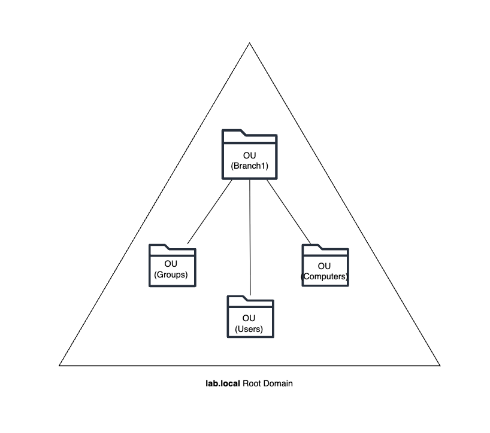
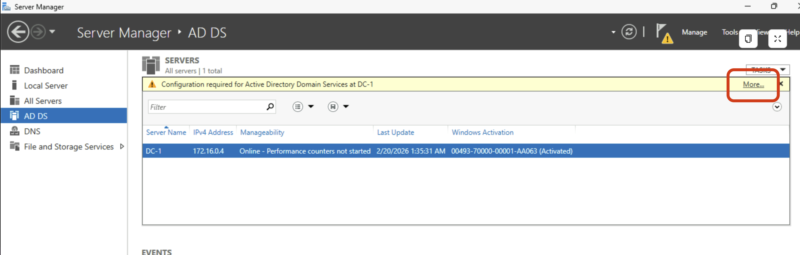
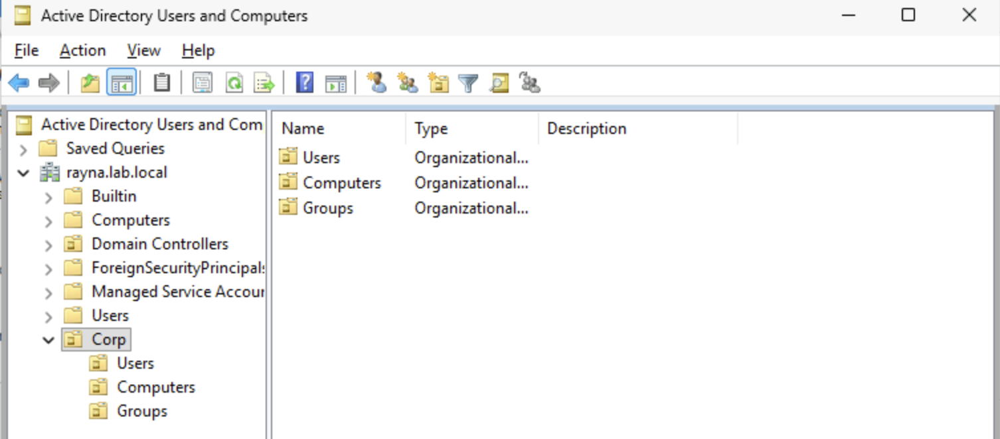
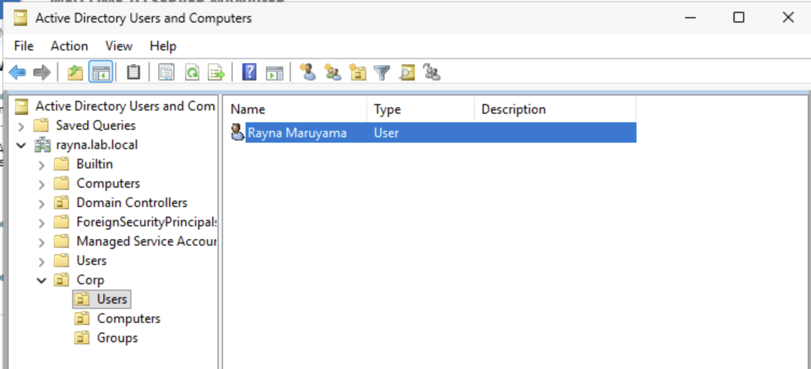

# Domain Controller Promotion

## Objective
A Domain Controller (DC) manages authentication, authorization, and directory services for users, groups, and computers within a Windows domain. The purpose of this lab is to promote a Windows Server to a Domain Controller by installing and configuring Active Directory Domain Services (AD DS). 

In this lab, I will: 

- Promote a Windows Server to a DC
- Create a domain name
- Add forests and OUs
- Verify the steps

## Prerequisites
1. Have Windows Server hosted on Microsoft Azure cloud
2. Roles and Features are installed on Windows Server. 

    Those are:
- Active Directory Domain Services (AD DS)
- DNS Servers

\* For DC promotion, only AD DS and DNS Servers are required.

 Refer to: [Windows Server 2025 Deployment][wsd]

## Network Diagram

   
  <em>Figure 2: Domain Architecture Overview</em>

## Steps
### Step 1: Access All Servers Task Details and Notifications
- On the Server Manager, go to the 'AD DS' tab on the left and click on 'More..'

### Step 2: Promote the Windows server to a domain controller
- Click on 'Promote this server to a domain controller' under the Action column.

### Step 3: Deployment Configuration
- Select **Add a new forest** 
- Enter the **Root domain name** following this convention (____.local)

- Create a password for Directory Services Restore Mode (DSRM) in the Domain Controller Options tab.

- At the **Prerequisites Check** tab, install the necessary prerequisites, and the system will restart after a successful installation.

### Step 4: Verify Active Directory Installation
- Search for 'Active Directory Users and Computers' in the search bar and verify that the domain you created are visible.

    \* Organizational Unit (OU) is populated under your root domain name that you created in Step 3.

### Step 5: Create Users, Groups, and Computers OU
- Right click on your **root domain name** -> **New** -> **Organizational Unit** and name your branch. 
- Right click on the OU you just created, add new -> OU, and name it 'Users.'
- Repeat the process to add 'Groups' and 'Computers' under your branch.

### Step 6: Add a User in the User OU
- Right click on **Users** you just created -> click **New** -> **User**
- Enter first, last name, and User logon name in this format: `firstInitial.lastname`
- Click **next**, and create an password and click **finish**.

*A user successfully created under the Users OU*

## Notes
- Domain Controllers have a writable copy of the Active Directory database, which allows any changes made to users, groups, or computures are automatically updates accross devices.

## Concepts used:
[Active Directory](../../00-concepts/concepts.md#🔸-active-directory)

[Domain Controller](../../00-concepts/concepts.md#🔸-domain-controller-dc)

[Organizational Unit](../../00-concepts/concepts.md#🔸-organizational-unit)

[Root Domain Name](../../00-concepts/concepts.md#🔸-root-domain-name)

[wsd]: /azure/windows-server-deployment/01-initial-deployment/windows-server-deployment.md