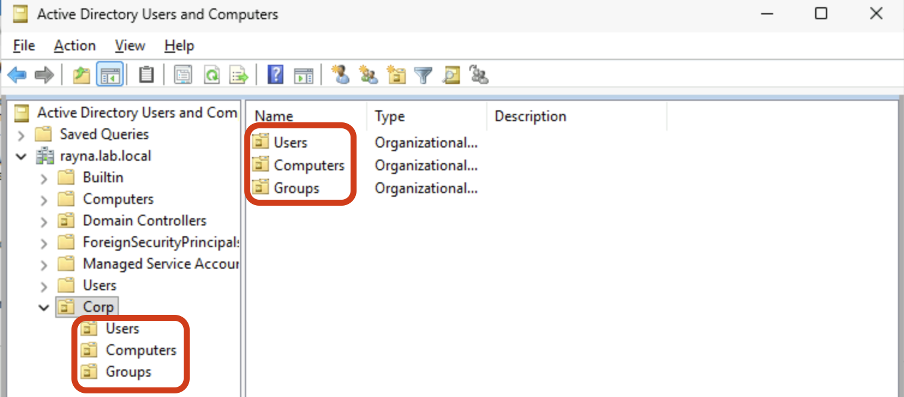
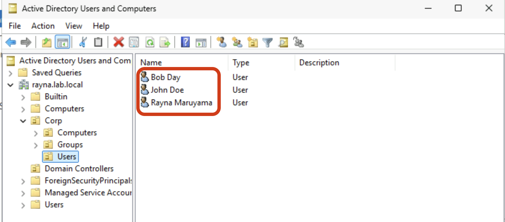
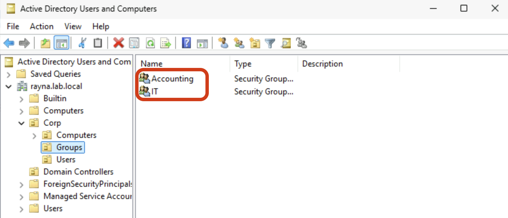
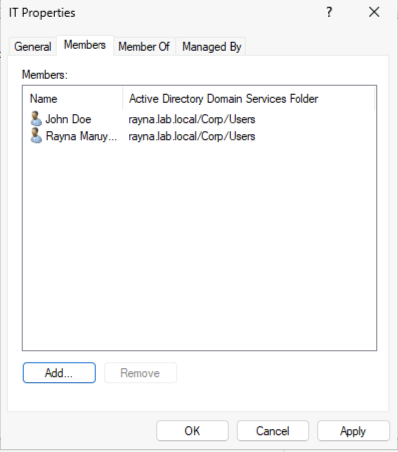
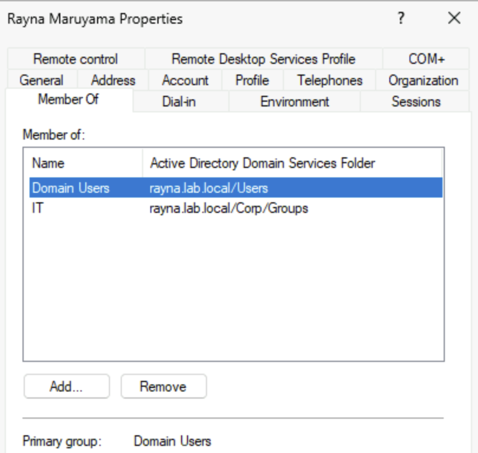

# Add Users and Groups

## Objective
The purpose of this lab is to add users and groups to the domain to organize permissions and roles. Adding users to the group OU saves time rather than individually assigning each user permissions. 

## Prerequisites
1. Have Windows Server hosted on Microsoft Azure cloud
2. Roles and Features are installed on Windows Server
    - Refer to: [Windows Server 2025 Deployment][wsd] 

3. Promote Windows Server to Domain Controller 
    - Refer to: [Domain Controller Promotion][dcp]

## Steps

### Step 1: Open Active Directory Users and Computers (ADUC)
- Search for **Active Directory Users and Computers** from the Start menu

### Step 2: Create Users, Groups, and Computers OU
- Right click on your **root domain name** -> **New** -> **Organizational Unit** and name your branch. 
- Right click on the OU you just created, click **New** -> **Orgnizational Unit**, and name it 'Users'
- Repeat the process for 'Groups' and 'Computers' under your branch.

  

### Step 3: Add users in the User OU
- Right click on **Users** OU you just created -> click **New** -> **User**
- Enter first, last name, and User logon name in this format: `firstInitial.lastName`
- Click **next**, and create a password and click **finish**.

  

  A user successfully created under the Users OU

### Step 3: Add groups
- Right click the **Groups** OU → **New** → **Group**
- Enter group name
- Specify:
  - Group scope: **Global**
  - Group type: **Security**

*Note: Distribution group is a collection of users accounts used primarily for sending emails to multiple people at once* 

  

### Step 4: Add Users to the Group
- Open Groups OU → right click on one of the group created → **Properties** → **Members** tab → click on **Add...** to add users to this group

  

*Note: Check what user is a member of by double clicking on a user and go to **Member of** tab*

  

## Notes
- Best practice is to assign permissions to **groups**, not individual users, and then add users to the appropriate groups.
- Groups are separated into roles/departments to have consistent assignment of permissions.
- If adding new users that has same permissions as other users. Copy the user from the **Users** container and rename the user. It will automatically populate the permissions into the same group.

## Concepts used in this lab
[Domain Controller](../../../00-concepts/concepts.md#🔸-domain-controller-dc)

[Organizational Unit](../../../00-concepts/concepts.md#🔸-organizational-unit)

[Root Domain Name](../../../00-concepts/concepts.md#🔸-root-domain-name)

[wsd]: /azure/windows-server-deployment/01-initial-deployment/windows-server-deployment.md

[dcp]: /azure/windows-server-deployment/02-domain-controller/promote-to-domain-controller.md