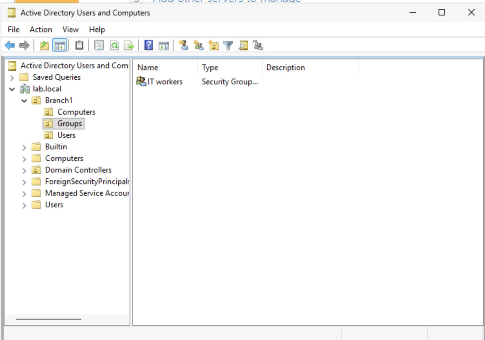
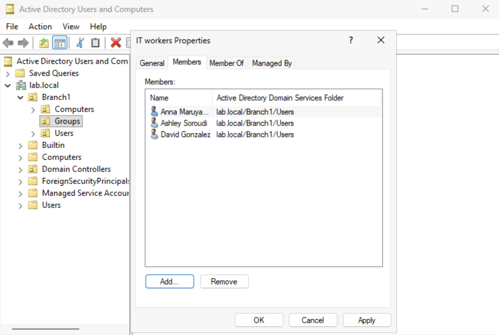

# Create Users and Groups

## Objective
The purpose of this lab is to add users to the domain and group them to keep permissions organized within the enterprise enviroment. Adding users to the group OU saves time rather than individually assigning each user permissions. 

## Prerequisites
1. Have Windows Server hosted on Microsoft Azure cloud
2. Roles and Features are installed on Windows Server
    - Refer to: [Windows Server 2025 Deployment](/azure/windows-server-deployment/01-initial-deployment/windows-server-deployment.md) 

3. Promote Windows Server to Domain Controller 
    - Refer to: [Domain Controller Promotion](/azure/windows-server-deployment/02-domain-controller/promote-to-domain-controller.md)

## Steps

### Step 1: Open Active Directory Users and Computers (ADUC)
- Search for "Active Directory Users and Computers" from the Start menu

### Step 2: Create a User Account
- Right click the **Users** container → New → User
- Enter the user's first name, last name, and logon name

  *Note: If multiple users require identical permissions, an existing user account can be copied and renamed*

### Step 3: Create a Group
- Right click the **Groups** container → New → Group
- Enter the group name
  - Example: 'IT Workers'
- Specify:
  - Group scope: **Global**
  - Group type: **Security**

### Step 4: Add Users to the Group
- Open the Groups → group name → Members tab → Add users

*Note: Check what user is a member of by double clicking on a user and go to **Member of** tab*

## Notes
- User account management tasks such as password resets, account unlocks, and account disablement are commonly performed through ADUC.
- Best practice is to assign permissions to **groups**, not individual users, and then add users to the appropriate groups.
- Groups are separated into roles/departments to have consistent assignment of permissions.
- If adding new users that has same permissions as other users. Copy the user from the **Users** container and rename the user. It will automatically populate the permissions into the same group.