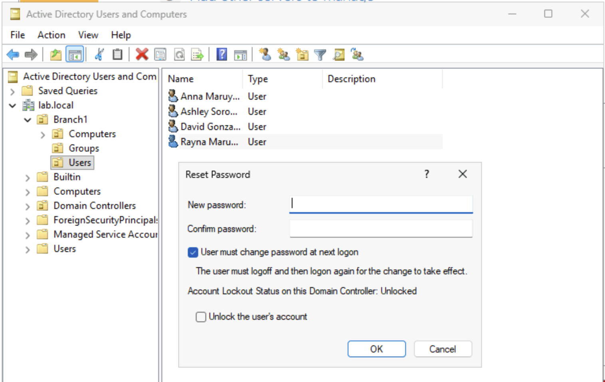
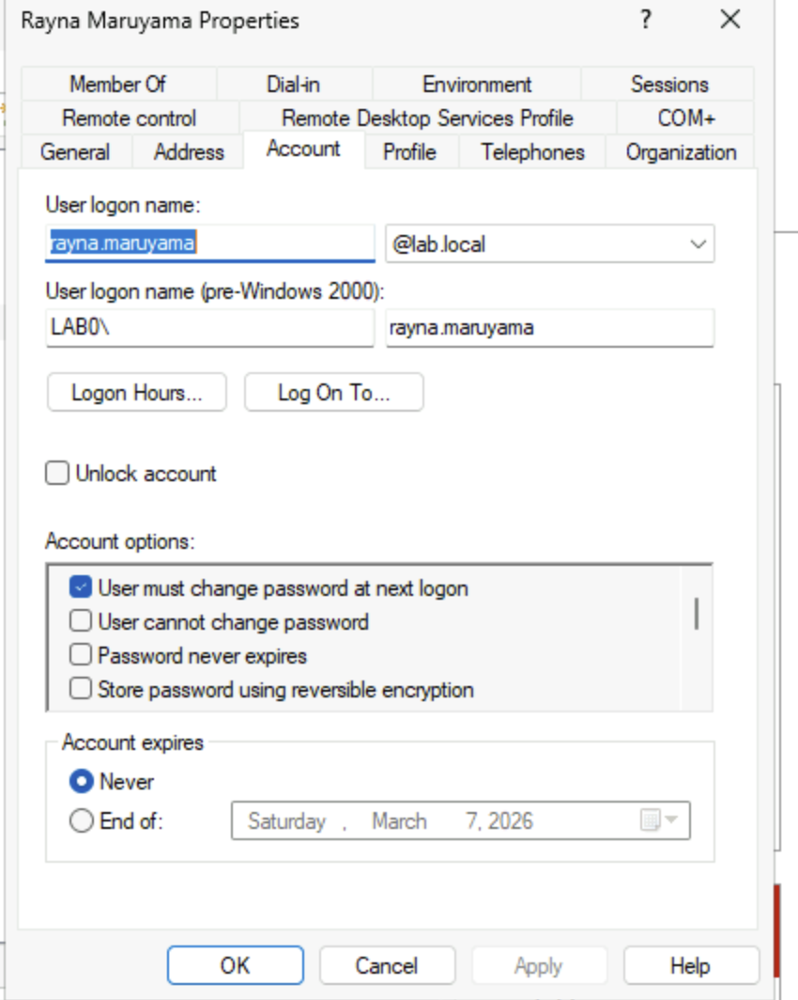
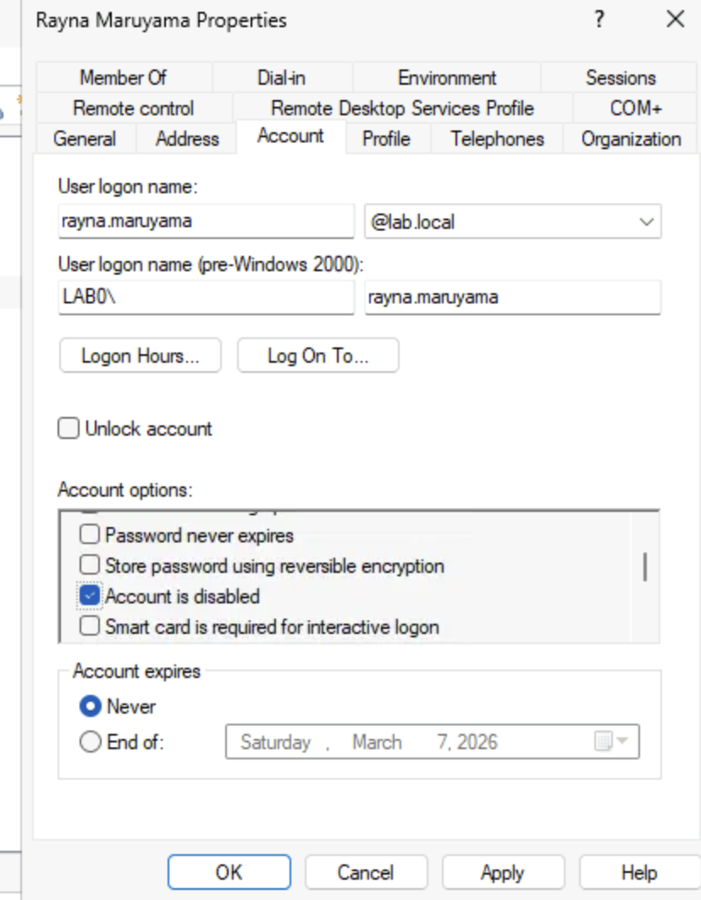
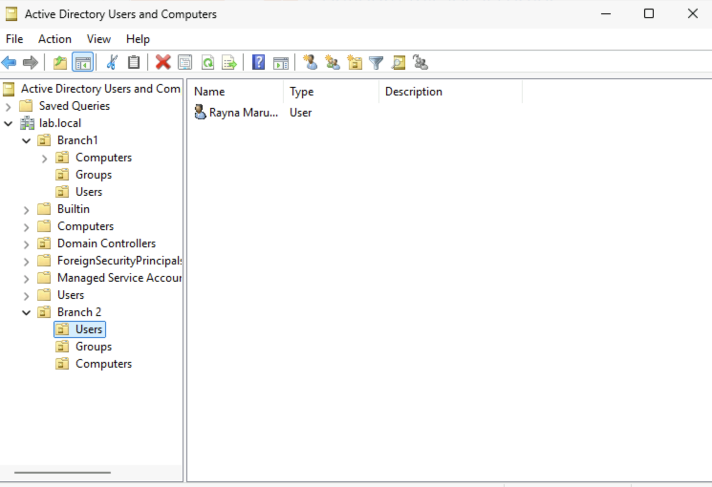

# User Account Management: Password Resets, States, and Lockouts

## Objective
The purpose of this lab is to manage user accounts by performing a password reset, modifying account states (enable/disable), and managing account lockout policy. 

## Prerequisites
1. Have Windows Server hosted on Microsoft Azure cloud
2. Roles and Features are installed on Windows Server
    - Refer to: [Windows Server 2025 Deployment](/azure/windows-server-deployment/01-initial-deployment/windows-server-deployment.md) 

3. Promote Windows Server to Domain Controller 
    - Refer to: [Domain Controller Promotion](/azure/windows-server-deployment/02-domain-controller/promote-to-domain-controller.md)

4. Users and groups are populated into the domain 
    - Refer to: [User and Group Management](/azure/windows-server-deployment/03-active-directory/01-user-and-group-management/create-users-and-groups.md)

## Steps to Reset Passsword
### Step 1: Reset Password
- Right click on a user from **Users** container.
- Click on "Reset Password"
- Enter new password and click "Ok"

---
---

## Steps to Unlock an account
### Step 1: Open Users Properties
- Double click on a user to go to users property
- Under 'Account' tab, tick or untick 'unlock account' to lock or unlock the account.

*Note: Verify that the user is actually locked out*

---
---

## Steps to Enable/Disable an Account
### Step 1: Open Users Properties
- Double click on a user to go to users property
- Under 'Account' tab, tick or untick 'Account is disabled' box

*Note: Make sure to verify why this user was diabled before enabling it* 
*Note: **Disabled**: user icon wil show a small downarrow.*

---
---
## Steps to Move Users to Another OU in Active Directory
### Step 1: Create another OU
Refer to: [Domain Controller Promotion - Step 5](/azure/windows-server-deployment/02-domain-controller/promote-to-domain-controller.md)

### Step 2: Move a user from one OU to another
- Select the usr from the source OU
- Click and drag the user to the destination OU (or right click and select **Move**) 

## Notes
