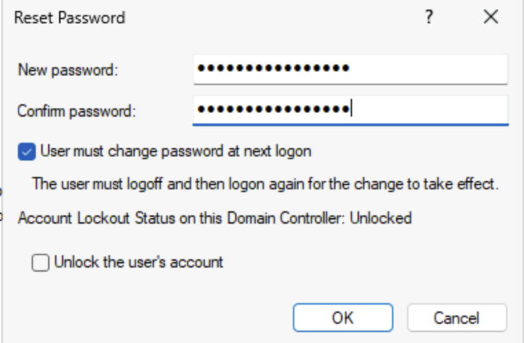
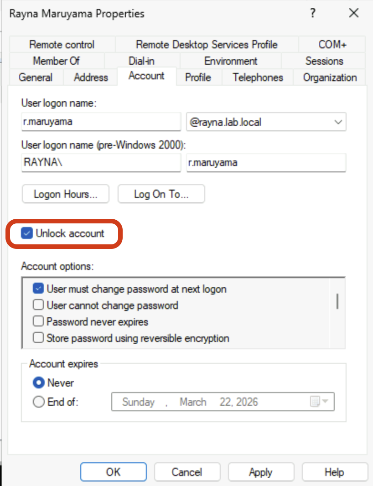
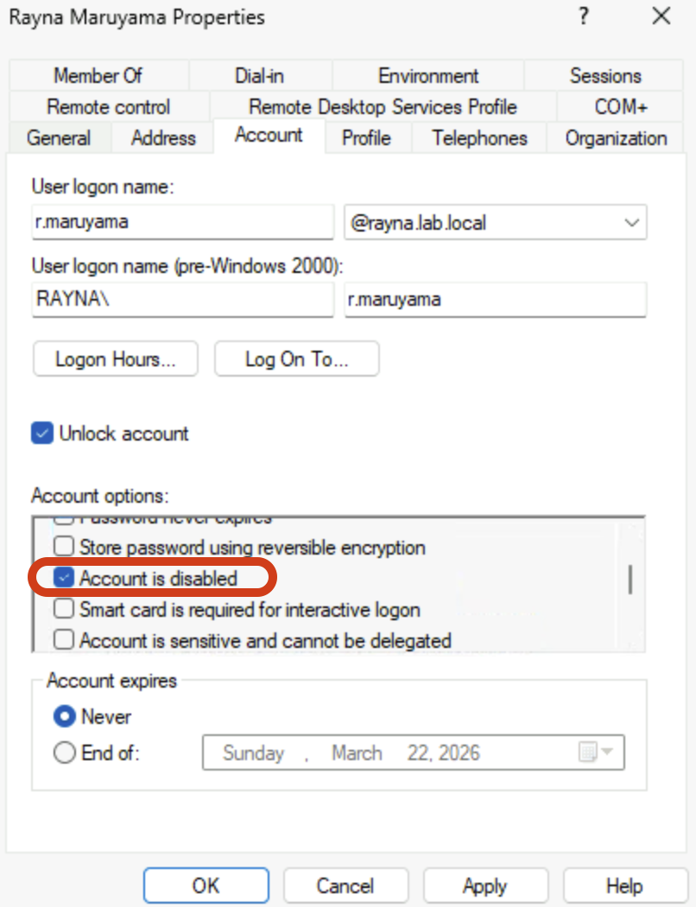

# User Account Management: Password Resets, Unlock Accounts, Enable/Disable Accounts

## Objective
This lab demonstrates how to manage Active Directory user accounts by performing password resets, modifying account states (enable/disable), managing account lockouts, and analyzing common troubleshooting scenarios. 

## Prerequisites
1. Have Windows Server hosted on Microsoft Azure cloud
2. Roles and Features are installed on Windows Server
    - Refer to: [Windows Server 2025 Deployment][wsd] 

3. Promote Windows Server to Domain Controller 
    - Refer to: [Domain Controller Promotion][dcp]

4. Users and groups are populated into the domain 
    - Refer to: [User and Group Management][ugm]

## Steps to Reset Passsword
### Step 1: Reset Password
- Right click on a user from **Users** OU.
- Click on **Reset Password...** from the menu
- Enter new password and click **OK**

    

<!-- TODO
scenario1: user cant log in after password reset
scenario 2: Password reset grayed out
 -->

---
---

## Steps to Unlock an account
### Step 1: Open Users Properties
- Double click on a user to go to users property
- Under **Account** tab, tick or untick **Unlock account** to lock or unlock the account.

    

<!-- TODO
Scenario 1: user account keeps getting locked out
scenario 2: Account not showing as locked but user cant log in

-->

---
---

## Steps to Enable/Disable an Account
### Step 1: Open Users Properties
- Double click on a user to go to users property
- Under **Account** tab, tick or untick **Account is disabled** box under **Account options**
- click on **Appy** then **OK**

    

*Note: If the account is disabled, verify the cause before enabling it* 

<!-- TODO
Scenario 1: user cant login bc account is disabled
-->

## Concepts used in this lab
[Domain Controller](../../../00-concepts/concepts.md#🔸-domain-controller-dc)

[wsd]: /azure/windows-server-deployment/01-initial-deployment/windows-server-deployment.md

[dcp]: /azure/windows-server-deployment/02-domain-controller/promote-to-domain-controller.md

[ugm]: /azure/windows-server-deployment/03-active-directory/01-user-and-group-management/add-users-and-groups.md