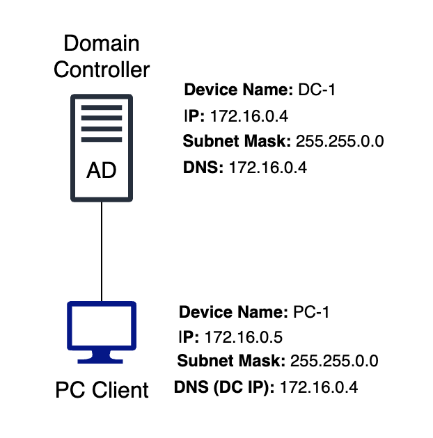
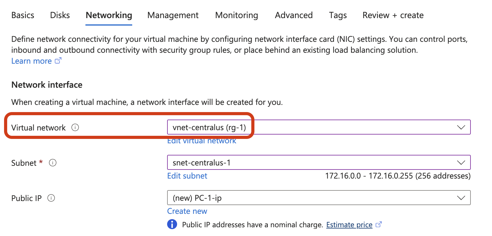
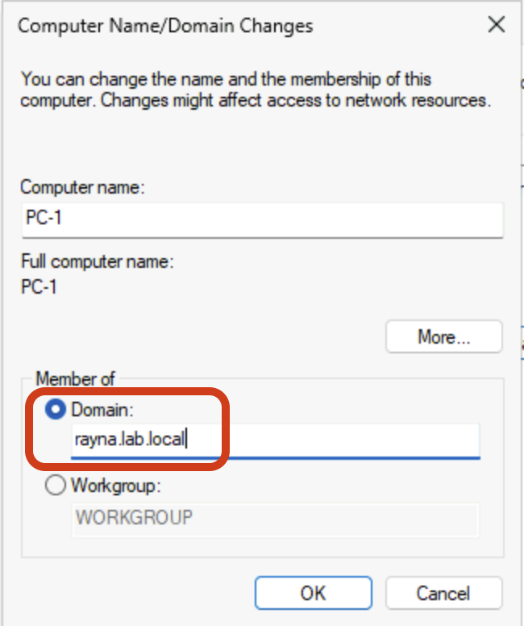
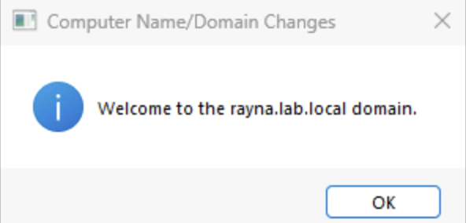
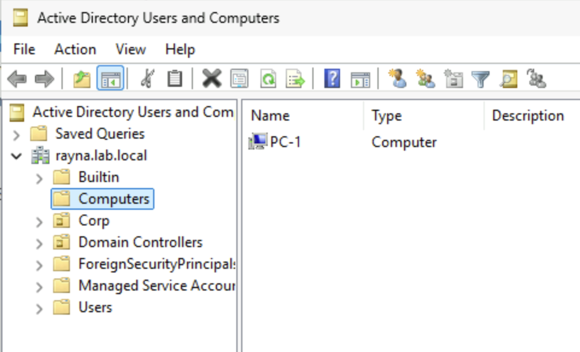
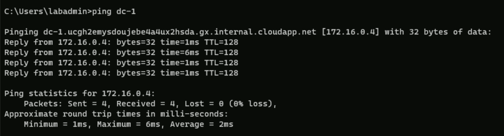
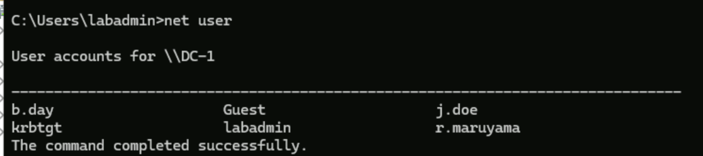
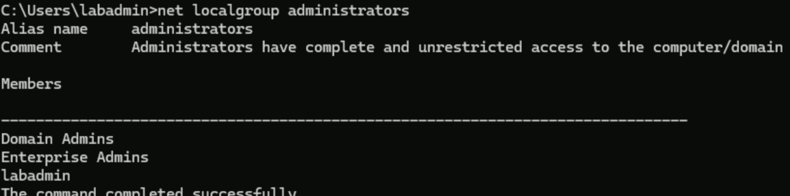
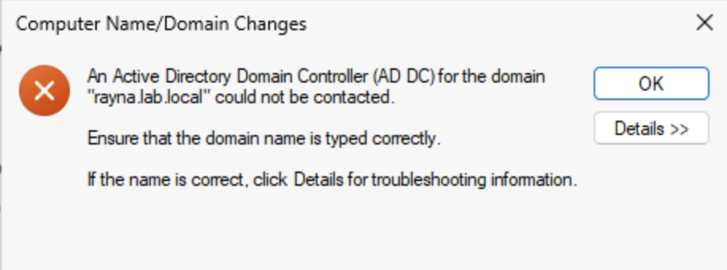

# Join a PC client to AD domain 

## Objective
The purpose of this lab is to understand how to domain join a PC and verify that a PC is connected to the DC.  

## Network Diagram

   
  <em>Configuration set up on the both DC server and PC Client</em>

## Prerequisites
1. Have Windows Server hosted on Microsoft Azure cloud
2. Roles and Features are installed on Windows Server
    - Refer to: [Windows Server 2025 Deployment][wsd]

3. Promote Windows Server to Domain Controller 
    - Refer to: [Domain Controller Promotion][dcp]

## Steps

### Step 1: Create a Virtual PC
*Note: In Microsoft Azure, use the Windows Server 2025 Datacenter image since the Windows 11 Pro requires a license*

- Follow the same setup in: [Windows Server 2025 Deployment][wsd] and name the VM.

- Check Virtual Network (VNet) by going to the **Networking** tab.
- Set **VNet** same as your DC servers.

    * **Note**: Virtual Machines within the same virtual network can communicate with each other by default.

- Go to **Network settings** and click on your NIC.

    

*Note: This PC should be in the same Virtual Network (VNet) as DC. Being in the same subnet simplifies configuration but not strictly required.*

### Step 2: Resolve this PC to domain name 
- On the PC, go to **DNS servers** under Settings.
- Click **Custom**
- (IMPORTANT!) The client must use the DC's private IP address as its primary DNS Server

*Note: Since this is on a Virtual machine and not on a actual enterprise enviroment, we would need to manually configure the DNS server to our Domain Controller*

### Step 3: Connect via Bastion for your PC

### Step 4: Connect Domain to PC
- Go to Settings from the Start menu on client PC
- **Systems** -> **About** -> **Advanced Systems Settings**
- Go to **Computer Name** tab
- The device is initially set to **WORKGROUP**
- Click **Change..** to join this PC to the DC
- Click **Domain** option under **Member of** and enter the same domain name from: [Domain Controller Promotion][dcp]

    

*Note: There may be an troubleshooting step here because Bastion sometimes does not update the DNS, so we would need to manually input the DNS IP address. See Troubleshooting steps for more information.*

- Enter the domain username and password.

    

- After successful login, a message will popup that the PC has successfulling joined to the domain. The computer will restart after successful joining.

    

### Step 5: Verify PC joining on DC
- Switch back to DC's VM and navigate to **Active Directory Users and Computers**. Under **Computers**, the newly created PC should appear.
- Move the new PC to the correct OU by dragging it to the branch you created called Computers.

    

### Step 6: Verify that the PC is Connected to the DC from Client PC
- Open Command Prompt on the PC
- Ping the domain name:
    - **ping [dcDomainName]** to test hostname resolution

        

        - If success you will recieve connection replies and if not, the request will time out.

- Go back to steps 4 to connect PC to Domain.

### Step 6: Commands to see User Accounts
- Run **net user** to see what user is on the system

     

- Run **net localgroup administrators** to see who is the member of the Administrators group.

    

---
---

## Troubleshooting:
If you see an error:

  

- This means that the DNS was not able to reach the domain. To troubleshoot this make sure that newly created PC is in the same subnet and Virtual network (VNet) as your DC.

### Steps:
1. In the search bar, type: **ncpa.cpl** to open Ethernet Connector on client PC.
2. Right click on Ethernet adapter and go to **Properties**
3. Click on IPv4, and go to **Properties**
4. Then, on a seporate tab, open **Command Prompt**
5. Run: **ipconfig /all** 
    - Check if your client PC's DNS Server IP address matches the DC's IP address.
    - If it does not match your DC's IP address, go back to IPv4 setting and manually enter your DC's IP address. Click **Ok** 

        

---
---

## Notes on Microsoft Azure:
- Joining a domain only works for windows version Pro/Enterprise. Windows home version does not have the functionally to join the server.

## Concepts used:
[Domain Controller](../../../00-concepts/concepts.md#🔸-domain-controller-dc)

[VNet](../../../00-concepts/concepts.md#🔸-vnet)

[Ethernet Connctor](../../../00-concepts/concepts.md#🔸-ethernet-connctor)

[wsd]: /azure/windows-server-deployment/01-initial-deployment/windows-server-deployment.md

[dcp]: /azure/windows-server-deployment/02-domain-controller/promote-to-domain-controller.md

[ugm]: /azure/windows-server-deployment/03-active-directory/01-user-and-group-management/add-users-and-groups.md