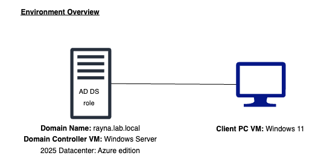
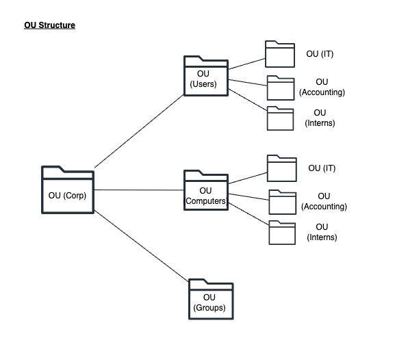

# Group Policy Object

## Objective
Group Policy Object (GPO) is a feature in Active Directory that enables to centrally manage and configure users and computers in a Windows environment. The objective of this lab is to configure and apply multiple Group Policy Objects (GPOs) in Active Directory using Group Policy Management Console to enforce security and user environment standards within a domain enviroment.

## Environment Overview

   
  <em>Basic Environment Structure</em>

   
  <em>Basic Active Directory OU structure</em>

## Prerequisites
1. Have Windows Server hosted on Microsoft Azure cloud
2. Roles and Features are installed on Windows Server
    - Refer to: [Windows Server 2025 Deployment][wsd]

3. Promote Windows Server to Domain Controller 
    - Refer to: [Domain Controller Promotion][dcp]

## Implementation summary
The following GPOs were created and applied based on security requirements.

### Password Policy

## Validation and Verification

## Troubleshooting Scenario

## Notes
- Every changes made to the Computer or User Configuration is updated onto the Registery
- **User configuration** only applies to users. All user configuration is applied for users in the users OU in AD.
- **Computer configuration** only applies to local computers. All computers listed under Computers OU in AD.
- Policies: cant be changeed by users (password policies, account lockout policies)
- Preferences: Can be modified by users. (printers, desktop shortcuts)

## Concepts used:

[Group Policy Management Console](../../../../00-concepts/concepts.md#🔸-group-policy-management-console)

[wsd]: /azure/windows-server-deployment/01-initial-deployment/windows-server-deployment.md

[dcp]: /azure/windows-server-deployment/02-domain-controller/promote-to-domain-controller.md#step-3-deployment-configuration